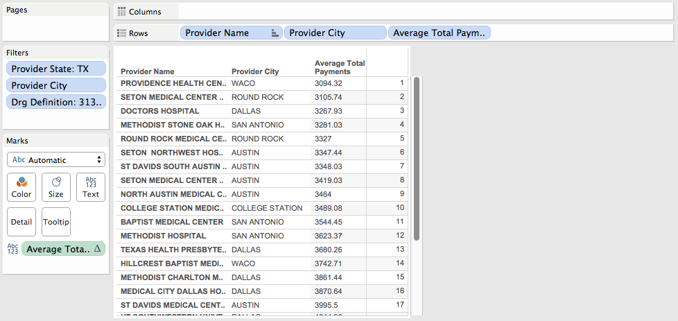
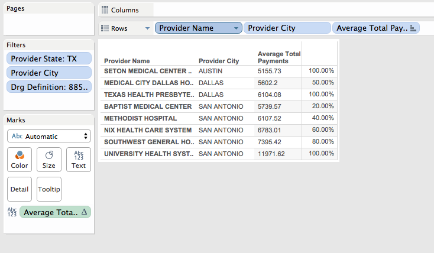

Elements Of Data Visualization: Tableau Project 2
===
__By Alex Cortez, Adam Hernandez, and Alex Pearce__

__GitHub__: https://github.com/joseacortez91/DV_TableauProject2

In this project, we utilize R and Tableau to generate various Crosstabs using data on hospital finances from across the country.

##First we will load up the necessary packages

```{r message=F}
source("../01 SQL Crosstabs/load_packages.R",echo=TRUE)
```

##Let's take a look at the full table
```{r message=F}
source("../01 SQL Crosstabs/full_df.R",echo=TRUE)
```

##Crosstabs

### This ranked Crosstab provides lowest average total payments for "Chest Pain" hospital visits in the central Texas area, and ranks them by affordability. 
####SQL
```{r message=F, results='asis'}
source("../01 SQL Crosstabs/rank.R",echo=TRUE)
```

####Tableau


***

###For this crosstab, we will be looking at Texas hospitals. Let's add two columns, one for the maximum average total payments per zip code and another for the difference between the current average total payments and the maximum

####Let's do it in SQL
```{r message=F, results='asis'}
source("../01 SQL Crosstabs/max_and_diff_TX.R",echo=TRUE)
```


####Now in Tableau


***

###For this Crosstab, we look at records where drg_definition = '069 - TRANSIENT ISCHEMIA' and the average total costs across cities in Texas. The nth_value function from the dplyr R package is used to find the maximum average total payment for each city.

####SQL
```{r message=F, results='asis'}
source("../01 SQL Crosstabs/nth.R",echo=TRUE)
```

####Tableau

***

###In this Crosstab, the SQL cumulative distribution function is utilized to return average cost information for central Texas, with cumulative distribution partitioned by city. These results are for records with the drg_definition of '885 - PSYCHOSES'

####SQL
```{r message=F, results='asis'}
source("../01 SQL Crosstabs/cume_dist.R",echo=TRUE)
```

####Tableau


***
