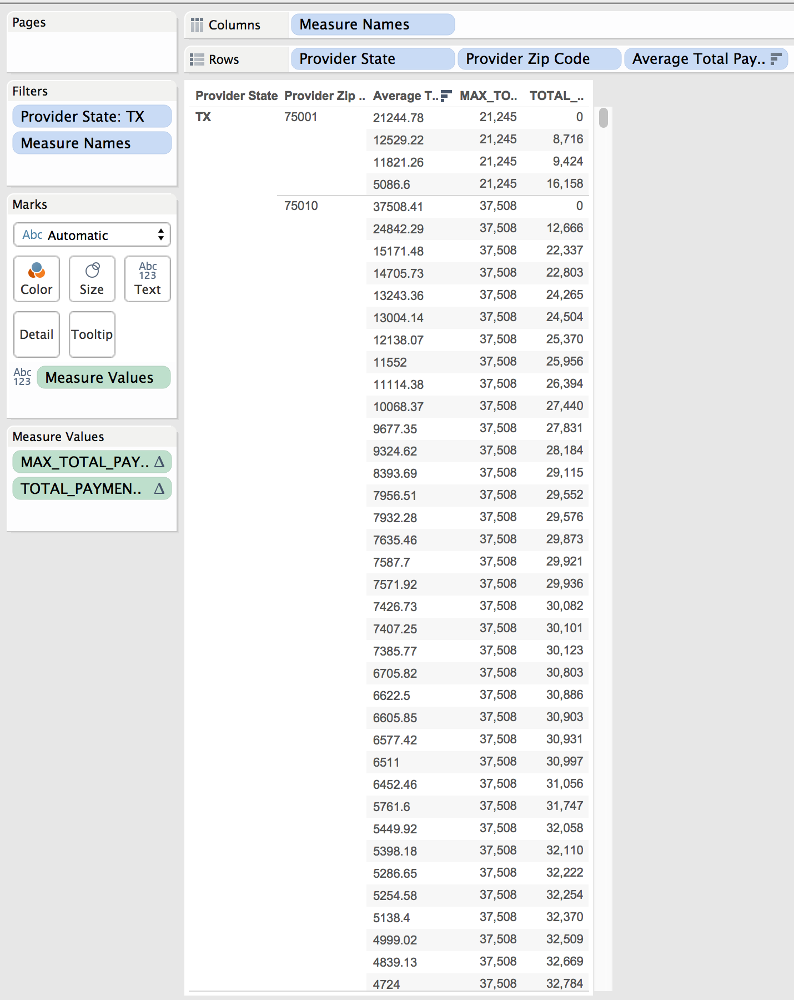

Elements Of Data Visualization: Tableau Project 2
===
__By Alex Cortez, Adam Hernandez, and Alex Pearce__

__GitHub__: https://github.com/joseacortez91/DV_TableauProject2

In this project, we utilize R and Tableau to generate various Crosstabs using data on hospital finances from across the country.

##First we will load up the necessary packages

```{r message=F}
source("../01 SQL Crosstabs/load_packages.R",echo=TRUE)
```

##Lets take a look at the full table
```{r message=F}
source("../01 SQL Crosstabs/full_df.R",echo=TRUE)
```

##Crosstabs

###Rank Crosstab description

####SQL


####Tableau

###For this crosstab, we will be looking at Texas hospitals. Let's add two columns, one for the maximum average total payments per zip code and another for the difference between the current average total payments and the maximum

####Let's do it in SQL
```{r message=F}
source("../01 SQL Crosstabs/max_and_diff_TX.R",echo=TRUE)
```


####Now in Tableau


***

###nth_value Crosstab description

####SQL


####Tableau

***

###cume_dist Crosstab description

####SQL


####Tableau

***
